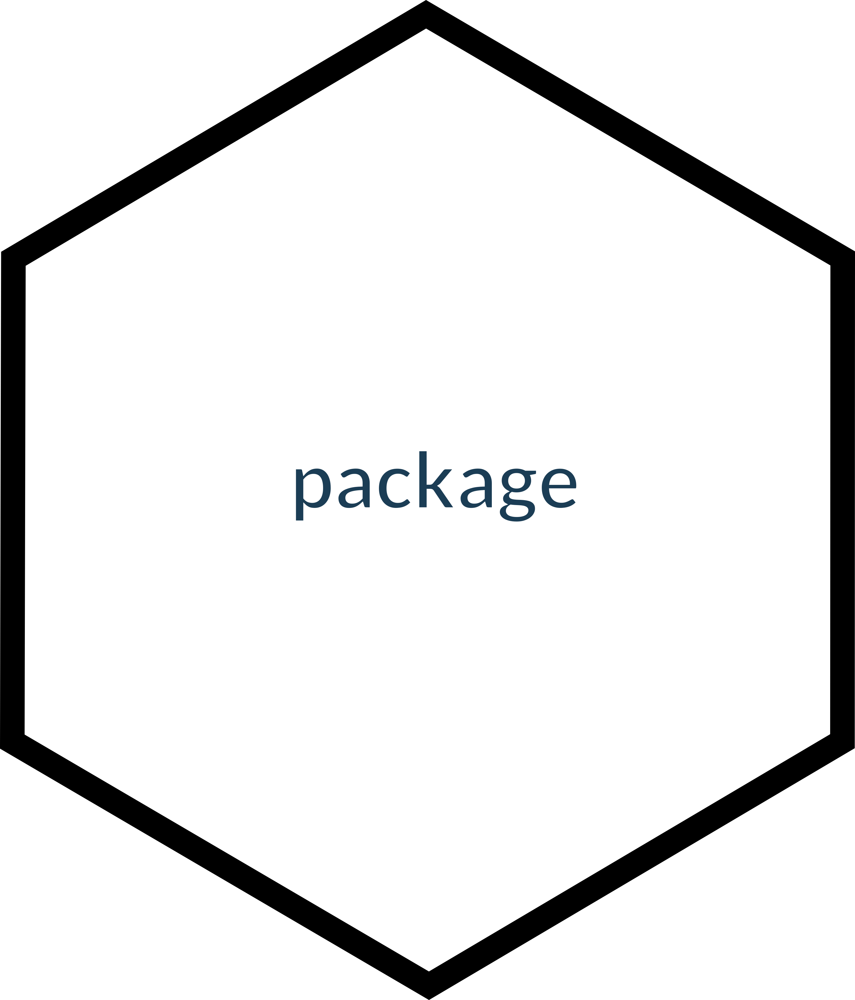

<!-- README.md is generated from README.Rmd. Please edit that file -->

# koala <br>

<!-- badges: start -->
<!-- badges: end -->

## Overview

`koala` is an R package that helps users standardize their data using
the [‘Darwin Core’](https://dwc.tdwg.org) data standard, used for
biodiversity data like species occurrences. The package provides tools
to edit, prepare and validate data against the standard’s criteria.
Darwin Core standard is . Once subsequently be shared as a [‘Darwin Core
Archive’](https://ipt.gbif.org/manual/en/ipt/latest/dwca-guide#what-is-darwin-core-archive-dwc-a)—a
packaged set of files with a simple descriptor to inform how data are
organised—and published to open data infrastructures like the Atlas of
Living Australia and GBIF. This package data against the Darwin Core
Standard. `koala` was built, and is maintained, by the [Science &
Decision Support Team](https://labs.ala.org.au) at the [Atlas of Living
Australia](https://www.ala.org.au) (ALA).

The package is named for an Australian arboreal species of marsupial.

If you have any comments, questions or suggestions, please [contact
us](mailto:support@ala.org.au).

## Installation

You can install the development version of koala from
[GitHub](https://github.com/) with:

``` r
# install.packages("devtools")
devtools::install_github("AtlasOfLivingAustralia/koala")
```

## Example

## Citing galaxias

To generate a citation for the package version you are using, you can
run:

``` r
citation(package = "koala")
```

The current recommended citation is:

> Westgate MJ, Balasubramaniam S & Kellie D (2024) koala: Tools to
> standardize biodiversity data. R Package version 0.1.0.9999.
